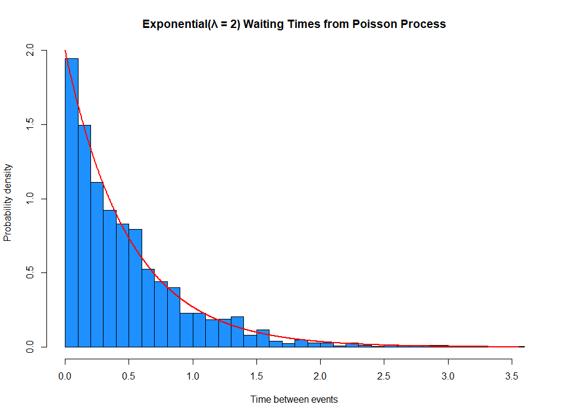

# Poisson waiting times

A very simple numerical simulation showing that the waiting times between events in a Poisson process follow an **Exponential(λ)** distribution.

The image below shows the simulated waiting times between events in a Poisson process with rate λ = 2 over a total time of 1000 units.
The blue histogram represents the simulated waiting times, while the red curve shows the theoretical exponential density:

